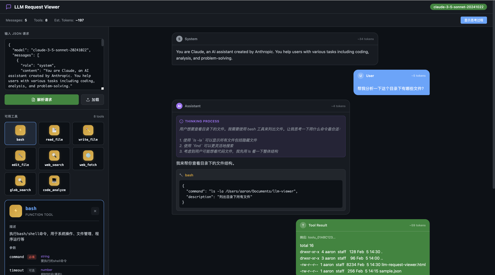

# LLM Request Viewer

一个浏览器端的 LLM 请求可视化工具，用于解析和展示 AI Agent 调用大模型时的请求数据。




## 功能特点

### 对话可视化
- **对话框形式展示**：模拟聊天界面，直观展示对话流程
- **角色区分**：
  - 左侧：Assistant 助手消息、System 系统消息
  - 右侧：User 用户提问、Tool 工具调用结果
- **思考过程展示**：支持 `reasoning_content` 字段，紫色高亮显示模型的思考过程
- **消息折叠**：长内容自动折叠，支持展开/收起

### 工具展示
- **图标网格**：工具以图标+名称的卡片网格展示
- **智能图标**：根据工具名称自动匹配 Emoji 图标
- **详情面板**：点击工具卡片展开详情，包含：
  - 工具描述（支持折叠）
  - 参数表格（名称、类型、必填/可选、描述）
  - JSON 调用示例

### 统计信息
- 模型名称识别
- 消息数量统计
- 可用工具数量
- Token 估算（基于字符数）

## 界面设计

### 视觉风格
- **现代化暗色主题**：紫蓝渐变背景，护眼配色
- **毛玻璃效果**：头部、侧边栏、统计栏使用 backdrop-filter 模糊
- **精致光影**：发光阴影、渐变边框、悬停动效
- **流畅动画**：消息入场动画、平滑过渡效果

### 配色方案
| 元素 | 颜色 |
|------|------|
| 背景 | 深蓝紫渐变 |
| 用户消息 | 紫蓝渐变背景 |
| 助手消息 | 深色半透明 |
| 工具调用 | 橙色边框 |
| 工具结果 | 柔和绿色半透明 |
| 工具图标 | 蓝紫渐变 |

## 使用方法

### 方式一：直接打开
```bash
# macOS
open llm-request-viewer.html

# Linux
xdg-open llm-request-viewer.html

# Windows
start llm-request-viewer.html
```

### 方式二：粘贴 JSON
1. 使用抓包工具（如 Charles、Wireshark）捕获 LLM 请求
2. 复制请求体中的 JSON 数据
3. 粘贴到工具左侧的输入框
4. 点击「解析请求」按钮

### 方式三：加载文件
1. 将抓包的 JSON 数据保存为 `.json` 文件
2. 点击「加载」按钮选择文件
3. 工具自动解析并展示

## 支持的请求格式

工具支持标准的 OpenAI 格式请求体：

```json
{
  "model": "claude-3-5-sonnet",
  "messages": [
    {
      "role": "system",
      "content": "You are a helpful assistant."
    },
    {
      "role": "user",
      "content": "Hello!"
    },
    {
      "role": "assistant",
      "reasoning_content": "The user is greeting me...",
      "content": "Hello! How can I help you today?",
      "tool_calls": [
        {
          "id": "tool_001",
          "type": "function",
          "function": {
            "name": "search",
            "arguments": "{\"query\": \"AI tools\"}"
          }
        }
      ]
    },
    {
      "role": "tool",
      "tool_call_id": "tool_001",
      "content": "Search results..."
    }
  ],
  "tools": [
    {
      "type": "function",
      "function": {
        "name": "search",
        "description": "Search for information",
        "parameters": {
          "type": "object",
          "properties": {
            "query": {
              "type": "string",
              "description": "Search query"
            }
          },
          "required": ["query"]
        }
      }
    }
  ]
}
```

## 界面说明

### 顶部状态栏
- 显示解析的模型名称
- 统计消息数、工具数、估算 Token 数
- 「显示/隐藏思考过程」切换按钮

### 左侧边栏
- **JSON 输入区**：粘贴或编辑抓包数据
- **工具列表区**：展示所有可用工具，点击展开详情

### 右侧对话区
- 以时间线展示完整对话流程
- 支持滚动查看历史消息
- 自动滚动到最新消息

## 消息类型样式

| 角色 | 位置 | 样式 |
|------|------|------|
| System | 左侧 | 灰色边框，深色背景 |
| Assistant | 左侧 | 紫色头像，深色背景 |
| User | 右侧 | 紫蓝渐变背景 |
| Tool | 右侧 | 柔和绿色半透明背景 |
| Tool Call | 左侧（嵌套） | 橙色边框 |

## 技术特点

- **纯前端实现**：单 HTML 文件，无需后端
- **无依赖**：不依赖任何第三方库
- **响应式设计**：适配不同屏幕尺寸
- **现代化设计**：毛玻璃效果、渐变配色、流畅动画

## 适用场景

- 🔍 **调试 Agent**：查看 AI Agent 与大模型的完整交互过程
- 📊 **分析请求结构**：理解复杂的多轮对话和工具调用链
- 📚 **学习示例**：研究优秀 Agent 的 prompt 设计
- 🧪 **测试验证**：验证工具定义和参数传递是否正确

## 快捷键

| 快捷键 | 功能 |
|--------|------|
| `Ctrl + Enter` / `Cmd + Enter` | 快速解析请求 |

## 浏览器兼容

- Chrome 80+
- Firefox 75+
- Safari 13+
- Edge 80+

## License

MIT License
